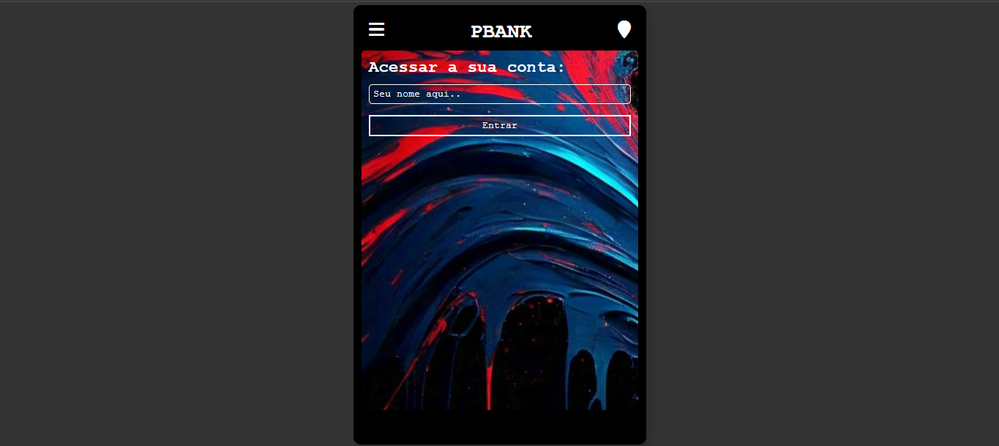
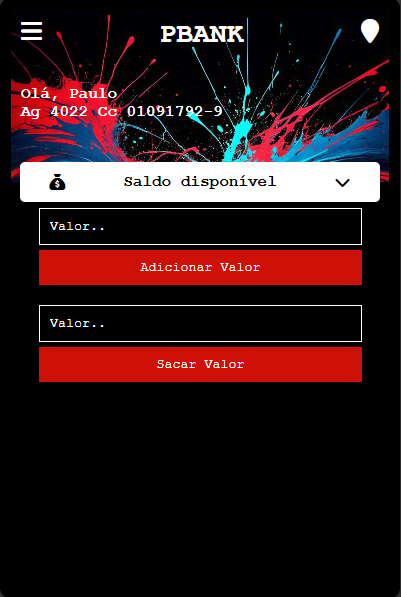
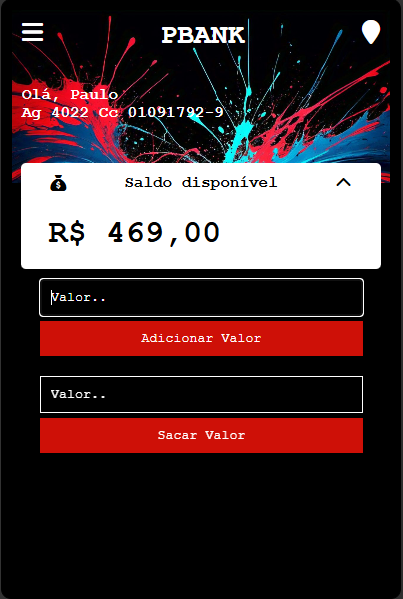
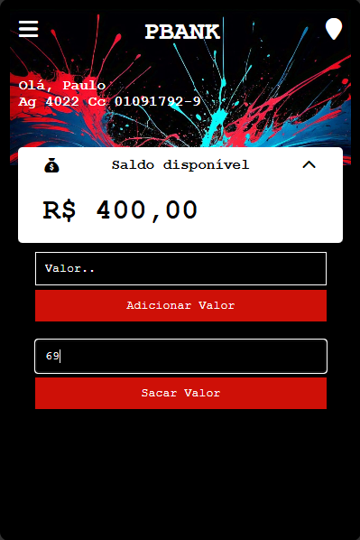

# **Gerenciador de Finanças Pessoais**

Um sistema simples e eficiente para controle de finanças pessoais, permitindo o gerenciamento de saldo, adição e remoção de valores. Este projeto foi desenvolvido como parte de meus estudos em PHP e desenvolvimento web. A ideia é proporcionar uma forma prática de controlar as finanças do dia a dia, com uma interface intuitiva e fácil de usar.

---

## **🛠️ Tecnologias Utilizadas**
- **PHP**: Linguagem de programação para o back-end e manipulação de dados.
- **HTML**: Estruturação da página.
- **CSS**: Estilização da interface do usuário.
- **Bootstrap**: Framework para criar uma interface responsiva e moderna.
- **JavaScript** (opcional): Para adicionar interatividade (por exemplo, validação de formulário).

---

## **📸 Exemplos de Tela**

Confira algumas capturas de tela que mostram como a interface se parece:

- **Página Inicial**  


- **Tela de Login**  


- **Tela Principal**  


- **Adicionar Valor**  


- **Sacar Valor**  


---

## **📌 Funcionalidades**

Este sistema oferece funcionalidades essenciais para o controle de finanças pessoais, incluindo:

- **Adicionar valores ao saldo**: Permite que o usuário adicione dinheiro à sua conta.
- **Subtrair valores (despesas)**: O sistema permite simular saques ou despesas.
- **Exibição de saldo total**: A qualquer momento, o usuário pode ver seu saldo total atualizado.
- **Interface intuitiva**: A navegação é simples, com campos claros e opções fáceis de entender.

---

## **🚀 Como Executar o Projeto**

### **Pré-requisitos**
Antes de executar o projeto, você precisará de:

1. Um servidor web com suporte a PHP. Você pode usar [XAMPP](https://www.apachefriends.org/), [WAMP](https://www.wampserver.com/), ou qualquer outro servidor com suporte a PHP.
2. Um navegador web de sua escolha para acessar a aplicação.

### **Passos para rodar o projeto**
1. Clone este repositório no seu computador:
   ```bash
   git clone https://github.com/seu-usuario/gerenciador-financas.git
