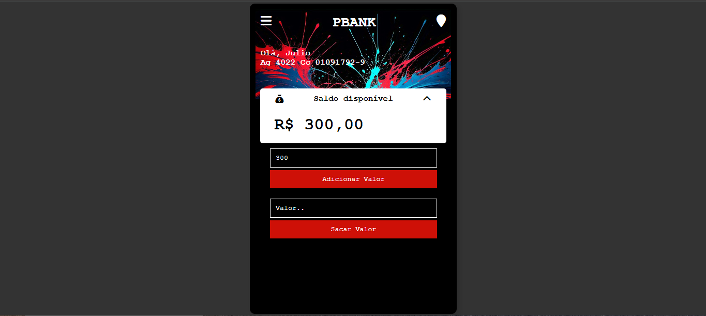
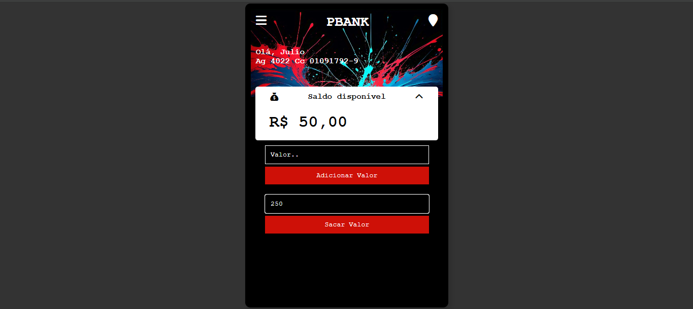

# **Gerenciador de Finanças Pessoais**

Um sistema simples e eficiente para controle de finanças pessoais, permitindo o gerenciamento de saldo, adição e remoção de valores. Este projeto foi desenvolvido como parte de meus estudos em PHP e desenvolvimento web. A ideia é proporcionar uma forma prática de controlar as finanças do dia a dia, com uma interface intuitiva e fácil de usar.

---

## **🛠️ Tecnologias Utilizadas**
- **PHP**: Linguagem de programação para o back-end e manipulação de dados.
- **HTML**: Estruturação da página.
- **CSS**: Estilização da interface do usuário.
- **Bootstrap**: Framework para criar uma interface responsiva e moderna.
- **JavaScript** (opcional): Para adicionar interatividade (por exemplo, validação de formulário).

---

## **📸 Exemplos de Tela**

Confira algumas capturas de tela que mostram como a interface se parece:

- **Página Inicial**  


- **Tela de Login**  


- **Tela Principal**  


- **Adicionar Valor**  


- **Sacar Valor**  


---

## **📌 Funcionalidades**

Este sistema oferece funcionalidades essenciais para o controle de finanças pessoais, incluindo:

- **Adicionar valores ao saldo**: Permite que o usuário adicione dinheiro à sua conta.
- **Subtrair valores (despesas)**: O sistema permite simular saques ou despesas.
- **Exibição de saldo total**: A qualquer momento, o usuário pode ver seu saldo total atualizado.
- **Interface intuitiva**: A navegação é simples, com campos claros e opções fáceis de entender.

---

## **🚀 Como Executar o Projeto**

### **Pré-requisitos**
Antes de executar o projeto, você precisará de:

1. Um servidor web com suporte a PHP. Você pode usar [XAMPP](https://www.apachefriends.org/), [WAMP](https://www.wampserver.com/), ou qualquer outro servidor com suporte a PHP.
2. Um navegador web de sua escolha para acessar a aplicação.

### **Passos para rodar o projeto**
1. Clone este repositório no seu computador:
   ```bash
   git clone https://github.com/seu-usuario/gerenciador-financas.git

---

## **🔧 Melhorias Futuras**
Embora o projeto esteja funcional, há várias melhorias que podem ser feitas para torná-lo ainda mais robusto:

- Autenticação de Usuário: Implementar sessões ou um banco de dados para que cada usuário tenha seu próprio acesso e dados protegidos.
- Gráficos de Desempenho: Adicionar gráficos interativos para visualizar o histórico financeiro do usuário.
- Histórico de Transações: Permitir que o usuário visualize um registro de todas as adições e subtrações realizadas.
- Multilinguagem: Adicionar suporte a múltiplos idiomas para maior acessibilidade.

---

## **📄 Licença**
- Este projeto está licenciado sob a Licença MIT. Veja o arquivo LICENSE para mais detalhes.

---

## **💻 Contato**
Criado por Paulo Victor – [Meu Linkedin](https://www.linkedin.com/in/paulo-barbosa-77199925a/)
Email: paulovdbarbosa@gmail.com

---

Feito com 💙 para aprendizado e compartilhamento de conhecimento. Se você tiver sugestões ou quiser colaborar, fique à vontade para entrar em contato!

---

## **📢 Contribuições**
Contribuições são bem-vindas! Se você quiser melhorar o projeto ou adicionar novas funcionalidades, sinta-se à vontade para abrir um pull request.